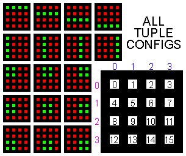
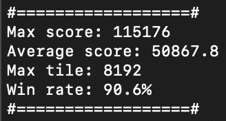

# N-Tuple Neural Network Plays 2048

The largest tile you can realistically reach in the game [`2048`](https://2048.io) is `131072`. However, unless you're an ultra-sweat or something, you probably only care about reaching `2048` and maybe `4096` or even `8192`. The average human being with a brain is able to do this fairly easily, but what about a computer?

There are a total of `12^16` possible states for the `2048` board for values of tiles ranging from `2` to `2048`. While this is nowhere near the amount of possible states for games like Chess or Go, it does mean that an AI agent or a heuristic-driven algorithm of some kind is needed to "beat" `2048`. Traditionally, algorithms like `minimax` and `expectimax` have been used to try and beat `2048`. However, it has been proven that one of the best structures for an autonomous `2048` player is an N-tuple network. This repository contains `C++` code that trains and tests a N-tuple `2048` bot (referred to as bot).

# Tuples

There are **a lot** of possible board states for `2048`. We can't possibly account for all of these, so we need to reorder/restructure the board in a way that will result in a smaller amount of total states. If you've ever solved a combinatorics or optimization problem with the `meet-in-the-middle` ([`example 1`](https://leetcode.com/problems/partition-array-into-two-arrays-to-minimize-sum-difference/description/), [`example 2`](https://leetcode.com/problems/closest-subsequence-sum/description/)) approach, we'll do something similar here.

Tuples can be thought of as contiguous subdivisions of the `2048` board. Some of these may overlap, and some may not overlap. The main takeaway is that we are dividing the board up into multiple chunks. When we try to calculate the number of possible states for each of these chunks, we see that there are **a lot** less states we have to deal with. For example, when only accounting for possible combinations of tiles from `2` to `2048` in a tuple that contains `4` elements, there are only `12^4 = 20736` states. The idea is that all of these tuples look at certain parts of the `2048` board and come to a decision together about the overall state of the board.

In the code, I only used tuples of size `4`. Additionally, I upped the maximum tuple tile number cap to `2^15 = 32768`, as in: the bot will consider all tiles up until `32768` valid tiles. All of the tuple configurations I used are shown below:



This results in `15^4 = 50625` total combinations for a tuple. There are `17` tuples in total, meaning that there are `17*50625 = 860625` total "mini-states". We can assign each one of these mini-states a weight. In order for the bot to make a decision, it will calculate a `key` using the values within the scope of each tuple. The key corresponds to the weight of a mini-state. (`tuple.weights[key] = weight of mini-state`). For example, say you start out with the overall state:

```{c++}
0 2 0 0
2 0 0 0
0 0 0 0
0 0 0 0
```

Let's use the tuple with the scope `{0,1,4,5}` as an example. This tuple essentially creates a key using the values `{0,2,2,0}` (in that order) and outputs a weight corresponding the the "value" of that specific section of the board when the board is in its current state. I will explain more in detail what "value" means later. For now, just understand that each tuple takes some of the values on the board and outputs a weight based on those values. The overall value we receive from all `17` tuples will then be averaged for a final output representing the tuples' collective opinion on a state. All the weights in a tuple are initialized as `0.0f` (since the tuple has learned nothing), and over a few hundred thousand games, each of these weights will be updated based on what the bot learned from moving in certain directions.

# Bot Decision Making/Learning

P.S.: `Reference [2]` describes the decision model used in many other N-tuple neural networks.

Although `2048` is **NOT** a deterministic game, there are deterministic aspects of it. For example, the state of the board directly after you input a valid move, **just before a random tile is added to the board** (this is called the `afterstate`, or `s'`). By focusing on the deterministic aspects of `2048`, we are able to train the bot more efficiently, as we don't have to look through all possible states after a move (adding a `2` or a `4` on all random free tiles).

In order for the bot to make a decision (which direction to move, if possible), it uses the current `state` (`s`) of the `2048` board. We need some way to quantify the value of the current state. Therefore, we will define a function `V(state)`, which essentially returns the tuples' collective opinion on a state. If this sounds familiar, its because you read it ~`2` paragraphs ago. This function `V(state)` returns the bot's estimation for the endgame score for `state`, or the score the bot expects to end the game with if it continued to play from `state`. Because there is no way to initially differentiate between which states are good, we will define another function `R(state,action)` (where `action` can also be represented as `a`) to determine the actual reward from performing an action on a state. This function just returns the total score increase from moving a certain way. For example, if you combined `4+4` by moving left, the reward you would receive is `R(state,left) = 8`. 

In order for the bot to decide which direction to move, it has to give an estimate for all the possible `afterstates` resulting from legal `actions`. In order to use the reward function `R(state,action)`, we need the bot to estimate the value of `state` after we perform `action` on it. Therefore, we use the `afterstate` in conjunction with `R(state,action)` to produce an estimate for endgame score after performing `action`. This can be summed up with this equation: `R(s,a) + V(s')`. In order to decide which direction to move in, we simply find the `action` that will produce the maximum `R(s,a) + V(s')` value.

Because `V(s')` is the estimator given by the bot, it will also be the value that is ultimately updated when we make the bot learn from its mistakes. We define the update function as `V(s') += alpha * delta`, where `alpha` is the learning rate, and `delta` is equal to temporal-difference error, further defined by this function: `TD-error = R(s_next,a_next) + V(s_next') - V(s')`. `s_next` refers to the `next state`, the `state` directly after the original `afterstate` `s'`. To put it simply, the `next state` is just the the `afterstate` with the random tile addition applied to it. `a_next` refers to the best possible `action` to be taken in the `next state`. `V(s_next')` therefore refers to the bot's estimation of the `next state's afterstate` after the best possible action `a_next` has been taken. Finally, `V(s')` is the original estimation for the `afterstate` `s'`. This update function is applied to all of the tuples' corresponding weights equally.

# Train Phase

Random tiles are generated following this algorithm in the original `2048` game:

- If there are tile open, find the first open tile
- Set that tile's value to `2` (`90%`) or `4` (`10%`)

In the `train` folder, you will find all of the `C++` code I used to train the bot along with a makefile already configured for the folder. No additional libraries are used aside from the STL. I coded up a quick `2048` clone that outputs to the terminal. The bot will save all of its parameters to `outfile.txt`.

# Local (Offline) Testing

The game logic remains the same. The game now keeps track of the number of new games started, as well as average score and win rate. These can be viewed with the `diagnostic()` function. The bot (`agent.h/.cpp`) doesn't have a `learn()` function or `alpha` anymore, since those aren't needed. Its constructor is also changed to only accept a string `path`, a path to a file that contains bot weights (this can be found at `local-test/bot/infile.txt` or `online-test/server/bot/infile.txt`). Some results of local testing are shown below.



# Online Testing

I used `Selenium` (`Python`) and sockets to create a bridge between the bot (`C++ server`) and a web scraper (`Python client`). All of the `C++` code (for both the server and the agent) can be found in `online-test/server`, along with a makefile. In `online-test/`, `scraper.py` is the client (connects to `2048.io`, gets board information) and `control.py` just runs both the server and the client. A sped up GIF of the bot playing `2048` online is shown below:


# References

1. K. Matsuzaki, "Systematic selection of N-tuple networks with consideration of interinfluence for game 2048," 2016 Conference on Technologies and Applications of Artificial Intelligence (TAAI), Hsinchu, Taiwan, 2016, pp. 186-193, [doi](10.1109/TAAI.2016.7880154)

2. M. Szubert and W. Jaśkowski, "Temporal difference learning of N-tuple networks for the game 2048," 2014 IEEE Conference on Computational Intelligence and Games, Dortmund, Germany, 2014, pp. 1-8, [doi](10.1109/CIG.2014.6932907)

3. “The Mathematics of 2048: Counting States with Combinatorics,” jdlm.info, Sep. 17, 2017. [web](https://jdlm.info/articles/2017/09/17/counting-states-combinatorics-2048.html)